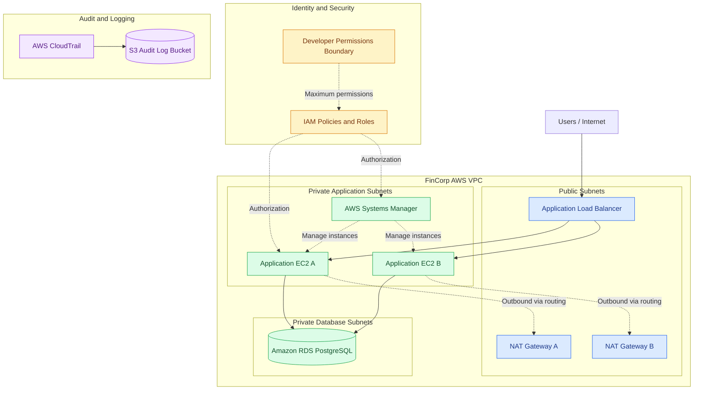

```mermaid
flowchart TB
    U["Users / Internet"] --> ALB["Application Load Balancer"]

    subgraph VPC["FinCorp AWS VPC"]
        subgraph PUB["Public Subnets"]
            ALB
            NAT1["NAT Gateway A"]
            NAT2["NAT Gateway B"]
        end

        subgraph APP["Private Application Subnets"]
            EC2A["Application EC2 A"]
            EC2B["Application EC2 B"]
            SSM["AWS Systems Manager"]
        end

        subgraph DB["Private Database Subnets"]
            RDS[("Amazon RDS PostgreSQL")]
        end

        ALB --> EC2A
        ALB --> EC2B
        EC2A --> RDS
        EC2B --> RDS
        EC2A -. "Outbound via routing" .-> NAT1
        EC2B -. "Outbound via routing" .-> NAT2
        SSM -. "Manage instances" .-> EC2A
        SSM -. "Manage instances" .-> EC2B
    end

    subgraph SEC["Identity and Security"]
        IAM["IAM Policies and Roles"]
        PB["Developer Permissions Boundary"]
    end

    subgraph AUDIT["Audit and Logging"]
        CT["AWS CloudTrail"]
        S3[("S3 Audit Log Bucket")]
    end

    IAM -. "Authorization" .-> EC2A
    IAM -. "Authorization" .-> SSM
    PB -. "Maximum permissions" .-> IAM
    CT --> S3

    classDef network fill:#dbeafe,stroke:#2563eb,color:#1e3a8a
    classDef compute fill:#dcfce7,stroke:#16a34a,color:#14532d
    classDef security fill:#fef3c7,stroke:#d97706,color:#78350f
    classDef audit fill:#f3e8ff,stroke:#9333ea,color:#581c87

    class ALB,NAT1,NAT2 network
    class EC2A,EC2B,RDS,SSM compute
    class IAM,PB security
    class CT,S3 audit
```
